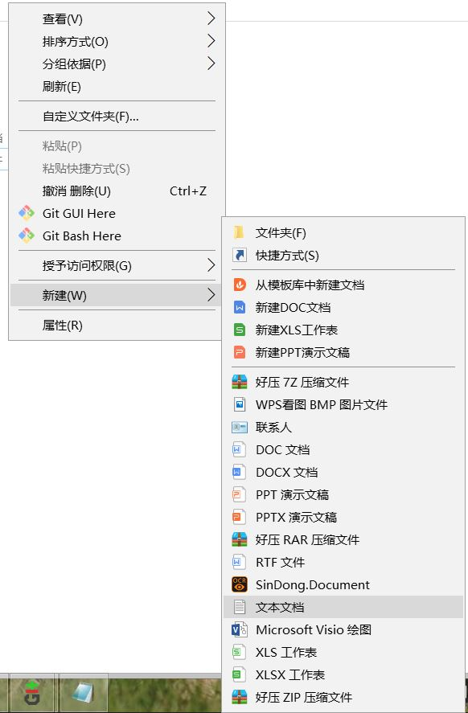

# git安装
## 到官网下载git

## 下载完成并安装 

# git简单使用
## 用户名和邮箱配置 

## 创建ssh key
打开git bash输入命令

ssh-keygen -t rsa -C"1776438044@qq.com"

按回车跳过自定义名称然后输入密码

## 复制公钥
在本地用户目录下找到".ssh"文件夹

使用记事本打开"id_rsa.pub"文件,复制里面的内容

## 在gitlab中添加ssh key
用浏览器打开我的git账户，点击头像选择 Settings——>SSH Keys

把刚才复制的内容粘贴到key栏中，选择Add key

## clone项目到本地
在本地任意目录右击选择 git GUI here

用浏览器打开我创建的远程仓库，复制项目地址

把地址粘贴到git gui的source location一栏，本地地址注意要在后面加上一个不存在的目录名

选择Clone

稍等片刻

## 提交和上推
在本地仓库中对文件进行修改和增加，在git GUI中选择 rescan 重新扫描文件

部分文件可以看到右边窗口显示乱码，右击右边窗口，选择Encoding——>Unicode(UTF-8) 即可恢复正常，黑色字体是不变内容，绿色字体是新增加的内容，红色字体是修改的或删除的内容

点击左上窗口所有文件的图标，并在右下窗口写上提交信息，选择Commit——>Push

上推成功！

## 这时在远程仓库中新添了文件

# 增加.gitignore忽略文件
当我们必须把某些文件放在本地，又不想提交它时，我们需要创建一个忽略目录
## 在本地仓库新建一个文本文档

## 在文档中添加要忽略的内容

## 另存为所有文件，命名为.gitignore

## 上推到远程仓库

# 创建分支
## 选择branch菜单下的create选项

## 输入分支名字，点create

## 上推新的分支
选择刚刚创建的分支

## 检查远程仓库分支，可以看到刚刚提交的分支

# 切换分支
## 选择branch菜单下的checkout选项

## 选择分支，点checkout

# 合并分支
## 存在问题：远程仓库比本地仓库有更新内容导致上推失败
新的内容上推之前在本地另一个目录创建仓库B并下拉项目，再上推仓库A新的内容，这样仓库B的内容就比远程仓库旧。

修改仓库B的内容并上推，发现上推失败。

## 下拉远程仓库：GUI菜单 Remote——>Fetch from——>origin

## 合并分支：选择merge——>local merge

选择master分支，然后点merge

合并成功！

这时再作文件修改，就可以成功上推了。

##  合并后的分支图

# 删除分支
## 选择branch|delete
## 选择要删除的分支，选择delete
