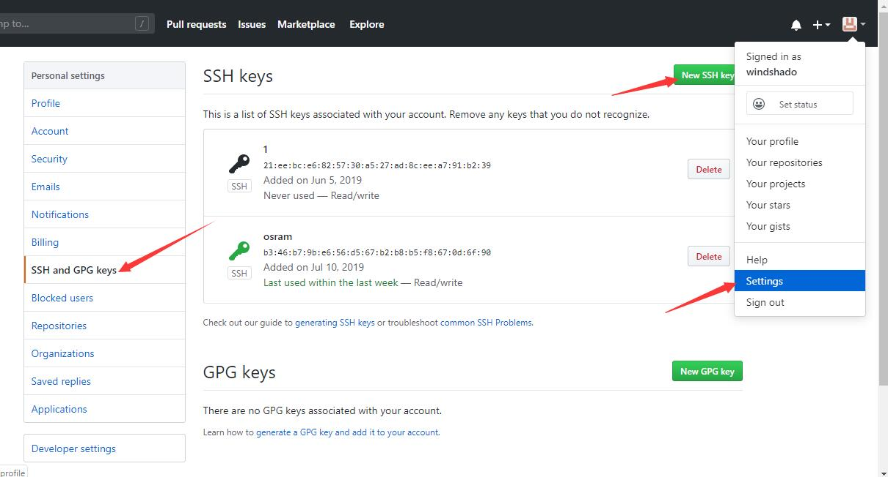

# git安装
## 到官网下载git
[点我下载](https://git-scm.com/download/win)

 
## 下载并完成安装 
 
在任意目录下，可以看到右击菜单多了一个git Bash和git GUI选项，说明已经安装成功。
# git简单使用
## 用户名和邮箱配置 
右击选择git Bash，输入

		$ git config --global user.name "Your Name"
		$ git config --global user.email "email@example.com"

输入 git config --list 检查是否设置成功
 
#创建本地和远程仓库
## 创建远程仓库
登录github账号，选择repositories-->new
 
输入你的仓库名称、描述、勾选Initialize this repository with a README-->创建
 

## ssh key
GitHub需要识别出你推送的提交确实是你推送的，而不是别人冒充的，而Git支持SSH协议，所以，GitHub只要知道了你的公钥，就可以确认只有你自己才能推送。GitHub允许你添加多个Key。假定你有若干电脑，你一会儿在公司提交，一会儿在家里提交，只要把每台电脑的Key都添加到GitHub，就可以在每台电脑上往GitHub推送了。
###创建ssh key
首先检查自己的账户目录下是否存在.ssh文件夹，若没有说明还没有创建ssh key 

打开git bash输入命令

		ssh-keygen -t rsa -C"email@example.com"
创建ssh key 

按回车跳过自定义名称然后输入密码（可以再直接按回车不设置密码）

 

### 复制公钥
在账户目录下找到".ssh"文件夹

 

使用记事本打开"id_rsa.pub"文件,复制里面的内容

 

### 在github中添加ssh key
用浏览器打开github账户，点击头像选择 Settings——>SSH and GPG Keys-->new SSH key

 

把刚才复制的内容粘贴到key栏中，Title给这个key起个名字，选择Add SSH key

 

## clone项目到本地
在任意目录下右击选择 git GUI here

 

用浏览器打开创建的远程仓库，复制项目地址

 

把地址粘贴到git gui的source location一栏，本地地址注意要在后面加上一个你要创建的仓库目录名

 

选择Clone

 

稍等片刻，远程仓库就克隆到本地仓库中了

 

## 提交和上推
在本地仓库中对文件进行修改和增加，在git GUI中选择 rescan 重新扫描文件

 

部分文件可以看到右边窗口显示乱码，右击右边窗口，选择Encoding——>Unicode(UTF-8) 即可恢复正常，黑色字体是不变内容，绿色字体是新增加的内容，红色字体是修改的或删除的内容

 

点击左上窗口所有文件的图标，并在右下窗口写上提交信息，选择Commit——>Push

 
 

上推成功！

 
## 这时在远程仓库中新添了文件
 

# 增加.gitignore忽略文件
当我们必须把某些文件放在本地，又不想提交它时，我们需要创建一个忽略目录
## 在本地仓库新建一个文本文档
## 在文档中添加要忽略的内容
		classes、classes/	路径中含有classes就被忽略
		/classes/*、/class/、classes/*		.gitignore同级目录classes下所有文件被忽略（建议用第一个）
		
		*.class	文件名以.class结尾的一类文件被忽略
		.class	文件名是.class的一个文件被忽略
		
		WebRoot/WEB-INF/classes、WebRoot/WEB-INF/classes/、WebRoot/WEB-INF/classes/*	.gitignore同级目录WebRoot下的WEB-INF/classes所有文件被忽略
		*/WEB-INF/classes、*/WEB-INF/classes/、*/WEB-INF/classes/*			.gitignore所有同级目录下的WEB-INF/classes下文件被忽略
		**/WEB-INF/classes、**/WEB-INF/classes/、**/WEB-INF/classes/*			所有路径中含有 WEB-INF/classes 的文件被忽略
		.gitignore 放在 .git 文件同级才会生效
 
## 另存为所有文件，命名为.gitignore
 
 并上推到远程仓库

# 创建分支
## 选择branch菜单下的create选项

## 输入分支名字，点create

## 上推新的分支
选择刚刚创建的分支

## 检查远程仓库分支，可以看到刚刚提交的分支

# 切换分支
## 选择branch菜单下的checkout选项

## 选择分支，点checkout

# 合并分支
## 存在问题：远程仓库比本地仓库有更新内容导致上推失败
新的内容上推之前在本地另一个目录创建仓库B并下拉项目，再上推仓库A新的内容，这样仓库B的内容就比远程仓库旧。

修改仓库B的内容并上推，发现上推失败。

## 下拉远程仓库：GUI菜单 Remote——>Fetch from——>origin

## 合并分支：选择merge——>local merge

选择master分支，然后点merge

合并成功！

这时再作文件修改，就可以成功上推了。

##  合并后的分支图

# 删除分支
## 选择branch|delete
## 选择要删除的分支，选择delete

